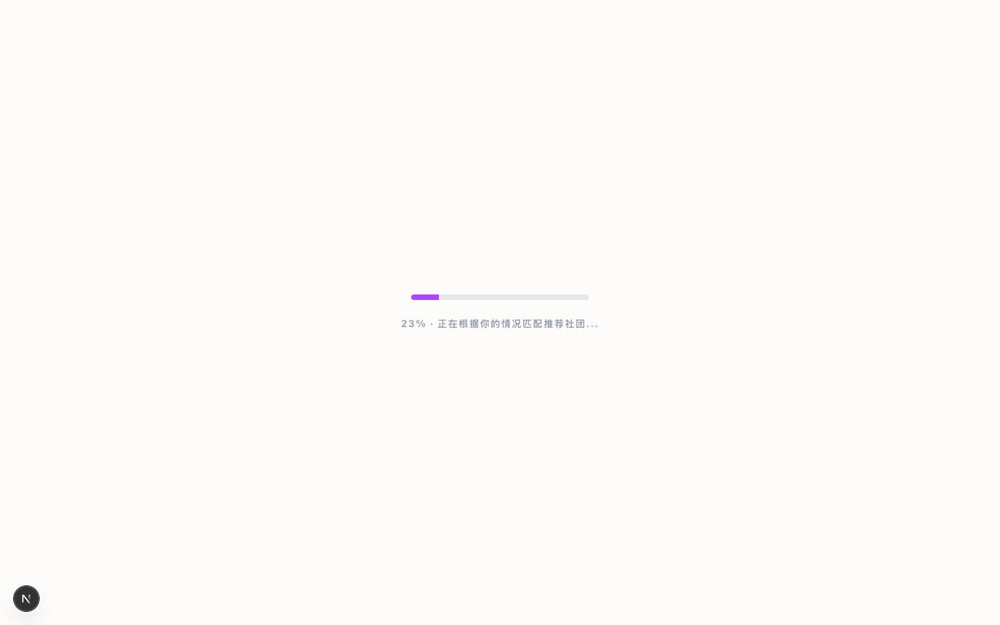
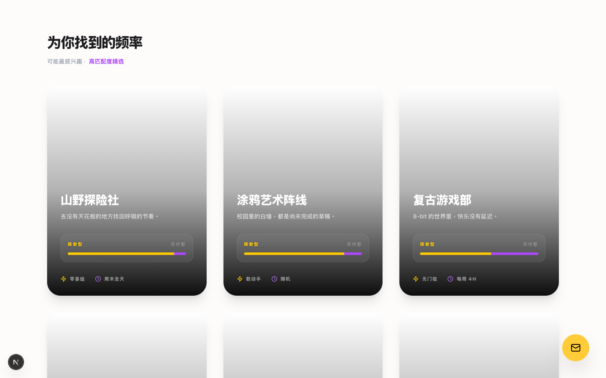
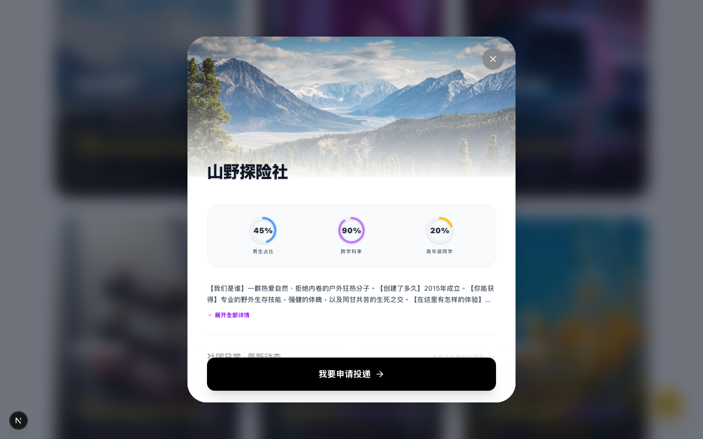
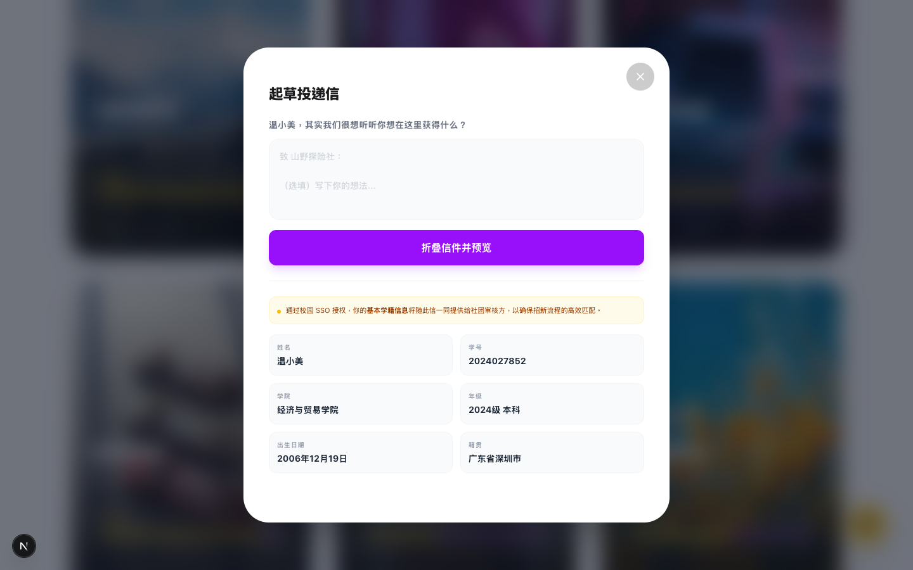
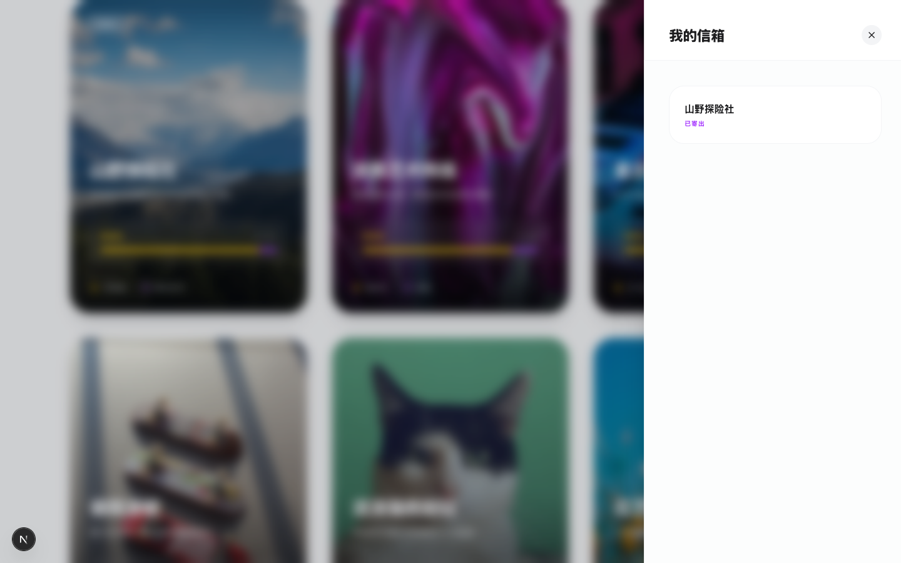

# 社团智能匹配平台 · Demo

<p align="center">
  
  
  
  
  
  
</p>

<p align="center">
  <strong>发现适合你的校园频率 —— 基于偏好画像的社团智能推荐与沉浸式投递系统</strong>
</p>

> **Demo / 课程作业原型** —— 本项目为校园社团招新场景的产品设计 Demo，数据均为模拟，不具备真实后端与 SSO 接入。用于展示前端交互设计与用户体验流程。

---

## 演示

> 以下截图通过 `npm run dev` 启动本地开发服务器后截取。你可以在项目根目录执行：
> ```bash
> npm run dev
> # 打开 http://localhost:3000
> ```

| 登录与气场拨盘 | 智能匹配加载 | 社团探索大厅 |
|:---:|:---:|:---:|
|  |  |  |
| 三维度偏好滑动拨盘，Tag 实时联动 | 进度条模拟匹配计算，Framer Motion 交互动画 | 高匹配度 Top 6 精选 + 全部社团瀑布流 |

| 社团详情（视差背景） | 信封投递（写信→盖章→飞出） | 个人信箱 |
|:---:|:---:|:---:|
|  |  |  |
| 社团画像数据可视化、公众号动态同步、微信群入口 | 拟真信封折叠动画，SSO 学籍信息自动附带 | 回执状态管理、未读红点、信件阅读 |

---

## 核心功能

### 1. 三维度气场拨盘
- **社交深度**：轻松交友 ↔ 硬核本领（重在参与 / 随遇而安 / 我是大佬）
- **能量类型**：i 人舒适区 ↔ e 人蹦迪场（默默潜水 / 偶尔冒泡 / 全场焦点）
- **时间投入**：课余打发时间 ↔ 全情投入（佛系打卡 / 劳逸结合 / 燃烧青春）
- 滑动选择实时联动 Tag 标签高亮，视觉反馈即时

### 2. 智能匹配引擎
- 基于 20 个真实社团数据（覆盖技术、户外、艺术、逻辑、运动等多元品类）
- 模拟匹配算法展示 Top 6 高匹配社团 + 其余全部社团
- 每个社团附带 **探索型 / 交付型 DNA** 比例条，直观呈现社团气质

### 3. 沉浸式社团详情页
- **视差滚动背景**：Hero 图片随滚动缩放、位移、渐隐
- **社团画像数据**：性别比、跨学科率、高年级占比（SVG 环形图）
- **公众号动态同步**：3 篇自动生成推文，支持订阅推送
- **招新咨询入口**：微信群二维码 + 负责人联系方式

### 4. 拟真信封投递系统
- **写信**：多行文本输入，SSO 学籍信息（姓名/学号/学院/年级/出生日期/籍贯）自动展示
- **折叠预览**：信封纹理水印、收件人落款
- **盖章投递**：红色圆形邮戳按钮，点击触发飞出动画
- **送达确认**：非打扰式 Toast 提示
- **异步回执**：5 秒后模拟收到社团回复（已录取 / 待面谈 / 遗憾落选）

### 5. 个人信箱中心
- 右下角悬浮信箱入口，未读红点提示
- 申请历史抽屉，支持撤回申请
- 信件阅读器，沉浸式查看社团回复内容

---

## 交互流程

```
┌─────────────┐    ┌─────────────┐    ┌─────────────┐    ┌─────────────┐
│  SSO 登录   │───▶│  气场拨盘   │───▶│  智能匹配   │───▶│  探索大厅   │
│  (模拟)     │    │  3维度偏好   │    │  加载动画   │    │  Top6+全部  │
└─────────────┘    └─────────────┘    └─────────────┘    └──────┬──────┘
                                                                  │
                          ┌───────────────────────────────────────┘
                          │ 点击社团卡片
                          ▼
              ┌─────────────────────────────────────────┐
              │           社团详情 Modal                 │
              │  ┌─────────┐  ┌─────────┐  ┌─────────┐  │
              │  │ 视差背景 │  │ 数据画像 │  │ 动态推文 │  │
              │  └─────────┘  └─────────┘  └─────────┘  │
              │                                         │
              │  ┌─────────────────────────────────────┐│
              │  │      我要申请投递 → 写信 → 盖章      ││
              │  └─────────────────────────────────────┘│
              └─────────────────────────────────────────┘
                          │
                          ▼ 信封飞出动画
              ┌─────────────────────────────────────────┐
              │           右下角信箱入口                 │
              │     查看回执 / 阅读信件 / 撤回申请        │
              └─────────────────────────────────────────┘
```

---

## 技术栈

| 类别 | 技术 |
|------|------|
| 框架 | Next.js 16 (App Router) |
| 前端 | React 19, TypeScript 5 |
| 样式 | Tailwind CSS v4 |
| 动画 | Framer Motion (布局动画、视差滚动、AnimatePresence) |
| 图标 | Lucide React |
| 字体 | Geist Sans / Mono (Google Fonts) |

---

## 快速开始

```bash
# 克隆仓库
git clone https://github.com/CodeIsCheapShowMeThePrompt/mtu-club-platform.git
cd mtu-club-platform

# 安装依赖
npm install

# 启动开发服务器
npm run dev

# 打开浏览器访问 http://localhost:3000
```

---

## 项目结构

```
src/
├── app/
│   ├── components/
│   │   ├── LoginScreen.tsx        # SSO 登录页
│   │   ├── PrefsScreen.tsx        # 三维度气场拨盘
│   │   ├── SegmentedControl.tsx   # 滑动选择器组件
│   │   ├── MatchingLoader.tsx     # 匹配加载动画
│   │   ├── ExploreHall.tsx        # 社团探索大厅
│   │   ├── ClubCard.tsx           # 社团卡片（含 DNA 条）
│   │   ├── ApplicationModal.tsx   # 投递信封全流程 Modal
│   │   ├── DonutChart.tsx         # SVG 环形数据图
│   │   ├── MailboxDrawer.tsx      # 个人信箱抽屉
│   │   ├── LetterReader.tsx       # 信件阅读器
│   │   └── FeedbackToast.tsx      # 状态反馈 Toast
│   ├── hooks/
│   │   ├── useClubMatching.ts     # 匹配逻辑 & 状态管理
│   │   └── useApplication.ts      # 投递 & 信箱状态管理
│   ├── data/
│   │   └── index.ts               # 20 个社团完整数据集
│   ├── types/
│   │   └── index.ts               # TypeScript 类型定义
│   ├── page.tsx                   # 主页面（步骤路由）
│   ├── layout.tsx                 # 根布局
│   └── globals.css                # 全局样式
├── public/
│   └── resource/
│       └── qr.png                 # 社团招新群二维码占位图
└── next.config.ts
```

---

## 设计决策

### 为什么选择信封隐喻？
传统社团招新是填表 → 等通知的冰冷流程。本项目将「投递申请」重构为「写信给社团」的叙事——用户不是提交一份表格，而是写一封有温度的信。信封折叠、盖章、飞出的完整动画链，将功利性的申请行为转化为有仪式感的情感表达。

### 数据可视化的克制
社团画像仅展示 3 个核心维度（性别比、跨学科率、高年级占比），用小型环形图呈现。不堆砌数据，只呈现用户做决策时真正关心的信息。

### 探索型 vs 交付型 DNA
每个社团被打上 0~1 的 DNA 值，0 代表探索导向（山野探险、极限滑板），1 代表交付导向（极客工作室、AI 实验室）。进度条用黄/紫双色分割，让用户 0.3 秒内判断社团气质是否与自己匹配。

---

## License

Private research & demo repository. Not for redistribution.
