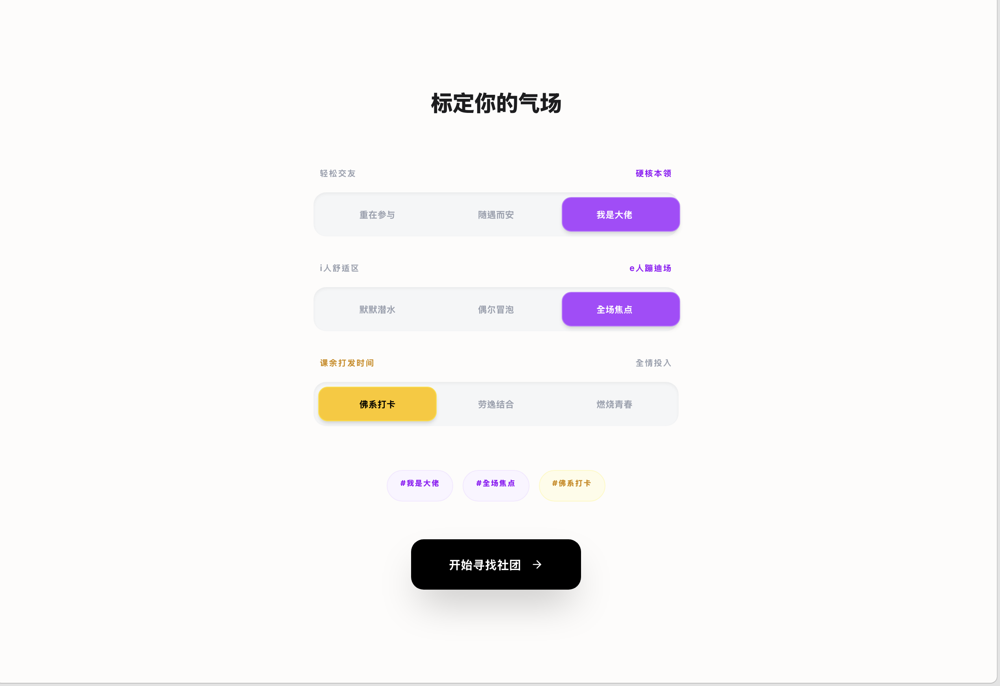

# 社团匹配平台 · Demo

<p align="center">
  
  
  
  
  
  
</p>

> 美团 AI Coding 笔试的产品原型。数据来源为模拟的 20 个社团信息，无真实后端与单点登录（SSO, Single Sign-On）接入。
>
> **在线演示：** https://mtu-club-platform.vercel.app

---

## 演示

以下截图通过 `npm run dev` 启动本地开发服务器后截取。你可以在项目根目录执行：

```bash
npm install
npm run dev
# 打开 http://localhost:3000
```

| 校园门户登录 | 三维偏好拨盘 | 社团探索大厅 |
|:---:|:---:|:---:|
|  |  |  |
| 模拟校园 SSO 授权登录，自动带出学籍信息 | 三维度物理拨盘，滑动选择实时联动标签 | 高匹配度 Top 6 精选 + 全部社团瀑布流 |

| 社团详情（视差背景） | 信封投递（写信→盖章→飞出） | 个人信箱 |
|:---:|:---:|:---:|
|  |  |  |
| 社团画像可视化、公众号动态、微信群入口 | 信封折叠动画，SSO 学籍信息自动附带 | 回执状态、未读红点、信件阅读 |

---

## 做这个 Demo 的动机

社团招新的真实痛点不复杂：大一新生面对几十个社团，不知道哪个适合自己，填表报名时也不知道该写什么。传统做法是发一张报名表，学生填完等通知，整个过程冷冰冰的。

这个 Demo 尝试换一种思路：把「简历筛选」改成「气场标定」，把「提交表格」改成「写一封信」。核心假设是，降低入场摩擦的关键不是让信息更全，而是让新生感觉到「这个系统懂我」。

---

## 几个关键的设计决策

**拨盘为什么不是性格测试？** 最早的方案考虑过让新生通过意识流对话或抽象图片选择来推断「精神底色」，但这太玄了——新生要花更多时间理解题目在问什么，反而增加了认知负担。最后改成三个维度的物理拨盘：社交深度（重在参与 / 随遇而安 / 我是大佬）、能量类型（默默潜水 / 偶尔冒泡 / 全场焦点）、时间投入（佛系打卡 / 劳逸结合 / 燃烧青春）——每个维度三档，滑动时有段落感。选择是明确的，结果也一目了然。

**匹配为什么不做虚拟试镜？** 另一个被否定的想法是让 AI 模拟社团氛围，让新生的「数字分身」先去体验一天。技术上无法在一个小时内落地，而且模拟出的「你可能会在第三周感到孤独」更像卖家秀，可信度存疑。退而求其次的做法是：用三个小型环形图展示社团的性别比、跨学科率和高年级占比，加上探索型 / 交付型 DNA 比例条，让用户在 0.3 秒内判断这个社团的气质是否对味。

**信封隐喻从哪里来？** AI 最初的建议是取消提交按钮，让用户把代表自己的图标拖向社团星云来完成意向交换。方向是对的——提交表格确实仪式感太重——但完全取消按钮在认知上过于激进。折中方案是保留「我要申请」的明确入口，但把后续流程包装成写信：输入框是多行文本，预览时折叠成信封纹理，点击红色邮戳后信封飞出视口。用户在完成一个沉重动作（投递意向）时，需要一个向上升腾的视觉反馈。

**反馈为什么不是状态标签？** 申请提交后，系统会在 5 秒后模拟收到社团回复。回复不是简单的「已通过」或「待面谈」，而是带联系方式的个性化长文。这个细节来自一个判断：AI 在这个场景里不应该替代人，而应该促成更有温度的人际连接。

---

## 技术栈

| 类别 | 技术 |
|------|------|
| 框架 | Next.js 16 (App Router) |
| 前端 | React 19, TypeScript 5 |
| 样式 | Tailwind CSS v4 |
| 动画 | Framer Motion |
| 图标 | Lucide React |
| 字体 | Geist Sans / Mono |

---

## 快速开始

```bash
git clone https://github.com/CodeIsCheapShowMeThePrompt/mtu-club-platform.git
cd mtu-club-platform
npm install
npm run dev
# 打开浏览器访问 http://localhost:3000
```

---

## 项目结构

```
src/
├── app/
│   ├── components/          # 页面组件
│   ├── hooks/               # 匹配逻辑 & 状态管理
│   ├── data/                # 20 个社团数据集
│   ├── types/               # TypeScript 类型定义
│   ├── page.tsx             # 主页面
│   ├── layout.tsx           # 根布局
│   └── globals.css          # 全局样式
├── public/
│   └── resource/
│       └── qr.png           # 社团招新群二维码
└── next.config.ts
```

---

## License

Private research & demo repository. Not for redistribution.
